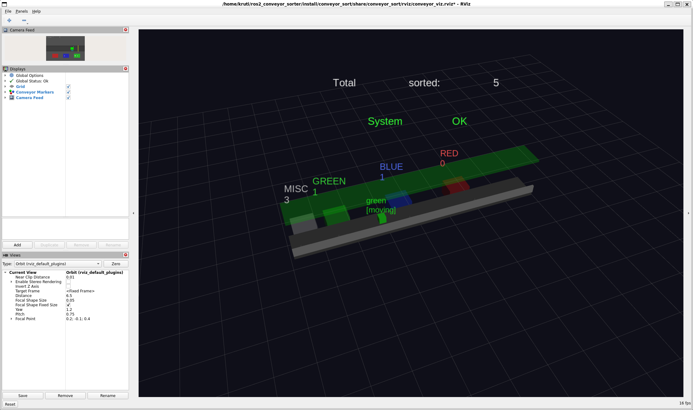
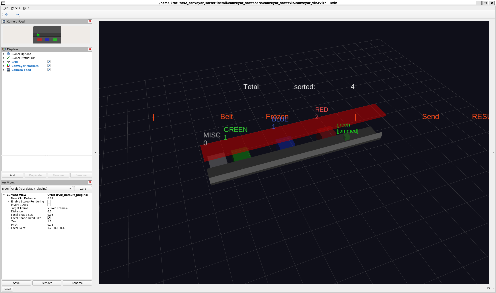
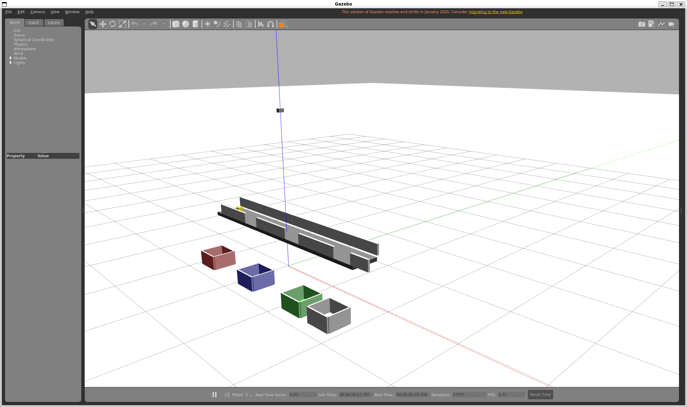

# Smart Vision-Based Conveyor Sorting System

A ROS2-based industrial conveyor belt simulation featuring real-time color detection, PID-controlled belt speed, automated sorting into color-matched bins, jam detection, operator control CLI, and 3D visualization in RViz. Built with C++, OpenCV, Python, and Gazebo on Ubuntu 22.04.

---

## Demo

**RViz — Normal Operation (RUNNING)**



**RViz — Jam Detected**



**Gazebo — Physical World**



---

## Table of Contents

- [Overview](#overview)
- [System Architecture](#system-architecture)
- [Features](#features)
- [Tech Stack](#tech-stack)
- [Project Structure](#project-structure)
- [Prerequisites](#prerequisites)
- [Installation](#installation)
- [Running the Project](#running-the-project)
- [Belt Control CLI](#belt-control-cli)
- [Simulating a Jam](#simulating-a-jam)
- [ROS2 Topics](#ros2-topics)
- [Node Descriptions](#node-descriptions)
- [Concepts Demonstrated](#concepts-demonstrated)
- [Future Work](#future-work)

---

## Overview

This project simulates a real-world industrial conveyor sorting system using ROS2 as the middleware backbone. Colored boxes spawn onto a conveyor belt and are automatically sorted into color-matched bins using a computer vision pipeline. A fourth miscellaneous bin at the end catches any unrecognized colors.

An operator control CLI allows full manual control — start, stop, pause, resume, reset, and jam simulation — all reflected live in the RViz dashboard.

The system runs entirely in software with no physical hardware required. Gazebo provides the 3D physics world, RViz provides real-time monitoring, and all logic runs as ROS2 nodes in C++ and Python.

---

## System Architecture

```
┌──────────────────────────────────────────────────────────────────────┐
│                         ROS2 Node Graph                              │
├──────────────────────────────────────────────────────────────────────┤
│                                                                      │
│  [Gazebo World]                                                      │
│       │                                                              │
│       ▼                                                              │
│  [camera_node] ──/camera/image_raw──► [vision_node]                  │
│                                            │                         │
│                                    /detected_color                   │
│                                            │                         │
│                                            ▼                         │
│                                  [object_tracker_node]               │
│                                            │                         │
│                                    /object_position                  │
│                                            │                         │
│                    ┌───────────────────────┘                         │
│                    ▼                                                 │
│           [controller_node] ◄── /conveyor_speed                      │
│                    │         ◄── /belt_command                       │
│                    │         ◄── /belt_reset                         │
│          ┌─────────┼──────────┐                                      │
│          ▼         ▼          ▼                                      │
│   /conveyor_cmd /sorter_cmd /belt_status                             │
│          │         │          │                                      │
│          ▼         ▼          └──────────────────────┐               │
│  [conveyor_node] [sorting_node]                      ▼               │
│          │                                  [jam_monitor_node]       │
│   /conveyor_speed                                    │               │
│                                              /jam_alert              │
│                                                                      │
│  [spawn_boxes.py] ──/active_box──────────────────────►               │
│         │        ──/bin_counts──────────────────────► [rviz_display] │
│         │        ──/jam_sim_status─────────────────►                 │
│         │        ◄─/belt_command                                     │
│         │        ◄─/belt_reset                                       │
│         │        ◄─/simulate_jam                                     │
│                                                                      │
│  [belt_control.py CLI] ──/belt_command──────────────►                │
│                        ──/belt_reset────────────────►                │
│                        ──/simulate_jam──────────────►                │
│                        ◄─/belt_status                                │
│                                                                      │
│  [rviz_display_node] ──/conveyor_markers──► [RViz2]                  │
│                                                                      │
└──────────────────────────────────────────────────────────────────────┘
```

### Belt Layout

```
SPAWN                                                              END
  │                                                                 │
  ▼   [RED BIN]      [BLUE BIN]     [GREEN BIN]     [MISC BIN]    │
══╪══════╪══════════════╪══════════════╪════════════════╪══════════►
        X=-0.8         X=0.2         X=1.2            X=1.7
          ↑               ↑             ↑                ↑
        pusher          pusher        pusher        end of belt
        (red)           (blue)        (green)       (misc drops in)
```

---

## Features

| Feature | Description |
|---|---|
| Color Detection | HSV thresholding via OpenCV — detects red, blue, green |
| PID Speed Control | Custom PID controller maintains target belt speed |
| Automatic Sorting | Boxes pushed sideways into matching color bins |
| Misc Bin | Unknown colors (purple, yellow, orange, white) ride to end bin |
| Random Box Order | Boxes spawn randomly with ~25% chance of misc colors |
| Jam Detection | Monitors belt speed — alarm if low for 5+ seconds while running |
| Simulated Jam | Trigger belt freeze anytime via CLI — stays until cleared by operator |
| Operator CLI | start / stop / pause / resume / reset / jam / status |
| Live RViz Dashboard | Conveyor, moving box, pushers, bin counts, single status bar |
| Camera Feed | Synced to active box — shows same color as RViz |
| Gazebo World | SDF-based 3D world with conveyor, camera, 4 colored bins |
| Belt State Display | RViz status bar: green=RUNNING, yellow=PAUSED, orange=STOPPED, red=JAMMED |

---

## Tech Stack

| Layer | Technology |
|---|---|
| Middleware | ROS2 Humble |
| Simulation | Gazebo 11 |
| Visualization | RViz2 |
| Computer Vision | OpenCV 4 (via cv_bridge) |
| Language (nodes) | C++17 |
| Language (scripts) | Python 3.10 |
| Control | Custom PID controller |
| Build System | CMake + colcon |
| OS | Ubuntu 22.04 (WSL2) |

---

## Project Structure

```
ros2_conveyor_sorter/
└── src/
    └── conveyor_sort/
        ├── CMakeLists.txt
        ├── package.xml
        ├── include/conveyor_sort/
        │   ├── pid_controller.hpp
        │   └── jam_detector.hpp
        ├── src/
        │   ├── pid_controller.cpp
        │   ├── jam_detector.cpp
        │   ├── camera_node.cpp          # Camera synced to active box
        │   ├── vision_node.cpp          # HSV color detection
        │   ├── object_tracker_node.cpp  # Position tracking
        │   ├── controller_node.cpp      # PID + state machine + sorting
        │   ├── conveyor_node.cpp        # Motor simulation
        │   ├── sorting_node.cpp         # Bin assignment
        │   ├── jam_monitor_node.cpp     # Speed watchdog
        │   └── rviz_display_node.cpp    # RViz markers
        ├── scripts/
        │   ├── spawn_boxes.py           # Gazebo spawner + belt logic
        │   ├── belt_control.py          # Operator CLI
        │   └── plot_speed.py            # Optional speed plotter
        ├── msg/
        │   ├── DetectedObject.msg
        │   ├── ObjectPosition.msg
        │   └── JamAlert.msg
        ├── worlds/
        │   └── conveyor_world.sdf
        ├── models/
        │   ├── conveyor_belt/
        │   ├── colored_box/
        │   └── sorting_bin/
        ├── config/
        │   ├── pid_params.yaml
        │   └── vision_params.yaml
        ├── launch/
        │   ├── simulation.launch.py
        │   └── full_system.launch.py
        └── rviz/
            └── conveyor_viz.rviz
```

---

## Prerequisites

- Ubuntu 22.04 (native or WSL2)
- ROS2 Humble
- Gazebo 11
- Python 3.10+

---

## Installation

### 1. Install ROS2 Humble

```
https://docs.ros.org/en/humble/Installation.html
```

### 2. Install dependencies

```bash
sudo apt update
sudo apt install -y \
  ros-humble-gazebo-ros-pkgs \
  ros-humble-gazebo-ros \
  ros-humble-cv-bridge \
  ros-humble-image-transport \
  ros-humble-robot-state-publisher \
  ros-humble-xacro \
  ros-humble-rviz2 \
  python3-colcon-common-extensions \
  libopencv-dev
```

### 3. Clone the repository

```bash
mkdir -p ~/ros2_conveyor_sorter/src
cd ~/ros2_conveyor_sorter/src
git clone https://github.com/YOUR_USERNAME/ros2-conveyor-sorter.git conveyor_sort
```

### 4. Build

```bash
cd ~/ros2_conveyor_sorter
colcon build --symlink-install
source install/setup.bash
```

### 5. Add to bashrc (recommended)

```bash
echo "source /opt/ros/humble/setup.bash" >> ~/.bashrc
echo "source ~/ros2_conveyor_sorter/install/setup.bash" >> ~/.bashrc
source ~/.bashrc
```

### WSL2 display setup

```bash
echo "export DISPLAY=:0" >> ~/.bashrc
echo "export LIBGL_ALWAYS_SOFTWARE=1" >> ~/.bashrc
echo "export MESA_GL_VERSION_OVERRIDE=3.3" >> ~/.bashrc
source ~/.bashrc
```

---

## Running the Project

### Option A — Full simulation (Gazebo + RViz)

```bash
ros2 launch conveyor_sort simulation.launch.py
```

### Option B — RViz only (lighter, no Gazebo)

```bash
ros2 launch conveyor_sort full_system.launch.py
```

> **The belt starts STOPPED. Open the CLI and send `start` before boxes spawn.**

---

## Belt Control CLI

Open a second terminal while the simulation is running:

```bash
python3 ~/ros2_conveyor_sorter/src/conveyor_sort/scripts/belt_control.py
```

```
==================================================
  CONVEYOR BELT CONTROL CLI
==================================================
  start   — start belt from STOPPED state
  stop    — emergency stop (RESET needed to restart)
  pause   — freeze belt in place
  resume  — continue from PAUSE or clear a JAM
  reset   — clear all boxes + counts, belt → STOPPED
  jam     — simulate a jam (stays until resume/reset)
  status  — show current belt status
  help    — show this menu
  quit    — exit CLI
==================================================
```

### State machine

```
         START
    ──────────────► RUNNING ──── PAUSE ──► PAUSED
         ▲              │                     │
         │             STOP               RESUME
         │              │                     │
       RESET       STOPPED ◄──────────────────┘
    (any state)

JAMMED (from RUNNING):
  RUNNING ──► JAMMED ──► RUNNING  (via RESUME)
  JAMMED  ──► STOPPED    (via RESET)
```

### Command reference

| Command | Valid from | Effect |
|---|---|---|
| `start` | STOPPED | Belt runs, boxes spawn |
| `stop` | RUNNING, PAUSED | Emergency halt, box frozen. Needs RESET to restart |
| `pause` | RUNNING | Freezes belt and box in place |
| `resume` | PAUSED or JAMMED | Continues from pause or clears jam |
| `reset` | Any | Deletes all boxes, zeros counts, belt → STOPPED |
| `jam` | RUNNING | Freezes belt, stays jammed until resume/reset |

---

## Simulating a Jam

Via CLI:
```
belt> jam
  → JAM triggered! Send RESUME or RESET to clear.
```

Via topic directly:
```bash
ros2 topic pub --once /simulate_jam std_msgs/msg/String "data: 'jam'"
```

What happens:
- Belt freezes immediately
- RViz top bar turns red: `SIMULATED JAM | Belt Frozen | Send RESUME or RESET`
- Active box dims on belt showing `[jammed]`
- Jam persists until operator sends `resume` or `reset`

---

## ROS2 Topics

| Topic | Type | Description |
|---|---|---|
| `/camera/image_raw` | `sensor_msgs/Image` | Camera frames |
| `/detected_color` | `conveyor_sort/DetectedObject` | Color + position |
| `/object_position` | `conveyor_sort/ObjectPosition` | Belt position + gate flag |
| `/conveyor_cmd` | `std_msgs/Float32` | Speed command |
| `/conveyor_speed` | `std_msgs/Float32` | Measured speed |
| `/sorter_cmd` | `std_msgs/String` | Color to sort |
| `/jam_alert` | `conveyor_sort/JamAlert` | Jam status from watchdog |
| `/belt_command` | `std_msgs/String` | START/STOP/PAUSE/RESUME |
| `/belt_reset` | `std_msgs/String` | RESET command |
| `/belt_status` | `std_msgs/String` | RUNNING/PAUSED/STOPPED/JAMMED |
| `/active_box` | `std_msgs/String` | Current box color, position, state |
| `/bin_counts` | `std_msgs/String` | Per-bin sorted counts |
| `/simulate_jam` | `std_msgs/String` | Trigger jam |
| `/jam_sim_status` | `std_msgs/String` | JAM_ACTIVE / JAM_CLEARED |
| `/conveyor_markers` | `visualization_msgs/MarkerArray` | All RViz visuals |

---

## Node Descriptions

### `camera_node`
Publishes synthetic camera frames synced to `/active_box`. Shows current box color, position on belt, bin markers at bottom, and push arrow when sorting.

### `vision_node`
HSV thresholding for red/blue/green. Contour detection for bounding box and centroid. Publishes to `/detected_color`.

### `object_tracker_node`
Tracks object position along belt. Sets `approaching_gate` when within 150px of gate.

### `controller_node`
Full belt state machine. PID speed control at 10Hz. Sorting trigger at gate. Jam detection (speed-based, only when RUNNING). Responds to `/belt_command` and `/belt_reset`. Publishes `/belt_status`.

### `conveyor_node`
Simulates belt motor with inertia and noise. Produces realistic speed feedback.

### `sorting_node`
Logs actuator actions — which box goes to which bin.

### `jam_monitor_node`
Independent speed watchdog. Subscribes to `/belt_status` — only monitors when RUNNING. Resets timer on PAUSE/STOP to prevent false alarms.

### `rviz_display_node`
Publishes `MarkerArray` at 10Hz. Single status bar at top changes color per state. Bins with live counts. Moving box marker. Pusher arrows light up yellow when active.

### `spawn_boxes.py`
Full belt simulation. Manages Gazebo box lifecycle, Python position tracking, bin sorting logic, state machine sync, jam handling. Publishes active box state.

### `belt_control.py`
Operator CLI. Sends commands, shows status, confirmation prompt for reset.

---

## Concepts Demonstrated

### Software Engineering
| Concept | Where |
|---|---|
| ROS2 pub/sub | 10 nodes, 15+ topics |
| State machine | STOPPED → RUNNING → PAUSED → JAMMED with enforced transitions |
| Custom messages | DetectedObject, ObjectPosition, JamAlert |
| C++17 OOP | PID and JamDetector as reusable library classes |
| Python/C++ interop | Python spawner + C++ nodes on shared topics |
| CLI design | Interactive operator interface |

### Robotics & Control
| Concept | Where |
|---|---|
| PID control | Conveyor speed with reset on state change |
| Actuator simulation | Per-bin pneumatic pusher |
| Fault detection | Speed-based jam with grace period |
| Safety | Emergency stop, jam freeze, operator-required clear |

### Computer Vision
| Concept | Where |
|---|---|
| Color space conversion | BGR → HSV |
| Image thresholding | Per-color HSV masks |
| Contour detection | findContours |
| Centroid calculation | Moments |

### Industrial Automation
| Concept | Where |
|---|---|
| Conveyor control | Speed regulation, start/stop/pause |
| Color sorting | 3 known bins + 1 reject bin |
| Fault & alarm | Jam monitoring + RViz alert bar |
| Operator interface | Full belt control CLI |

---

## RViz Status Bar

| Colour | State | Action needed |
|---|---|---|
| Green | RUNNING | None — system operating normally |
| Yellow | PAUSED | Send `resume` |
| Orange | STOPPED | Send `reset` then `start` |
| Red | JAMMED | Send `resume` or `reset` |

---

## Versions

| Branch | Description |
|---|---|
| `main` | Latest — CLI, jam simulation, 4 bins, state machine, synced camera |
| `v1` | Original — basic sorting, auto-cycling camera, no operator control |

---


## Future Work

- [ ] Multi-object tracking with unique IDs
- [ ] Real Gazebo camera (native Ubuntu or GPU passthrough)
- [ ] Web dashboard via roslibjs
- [ ] ML color classifier replacing HSV thresholds
- [ ] Migrate to ROS2 Iron/Jazzy + Gazebo Harmonic
- [ ] Hardware-in-the-loop with physical camera
- [ ] Box throughput statistics and logging

---
